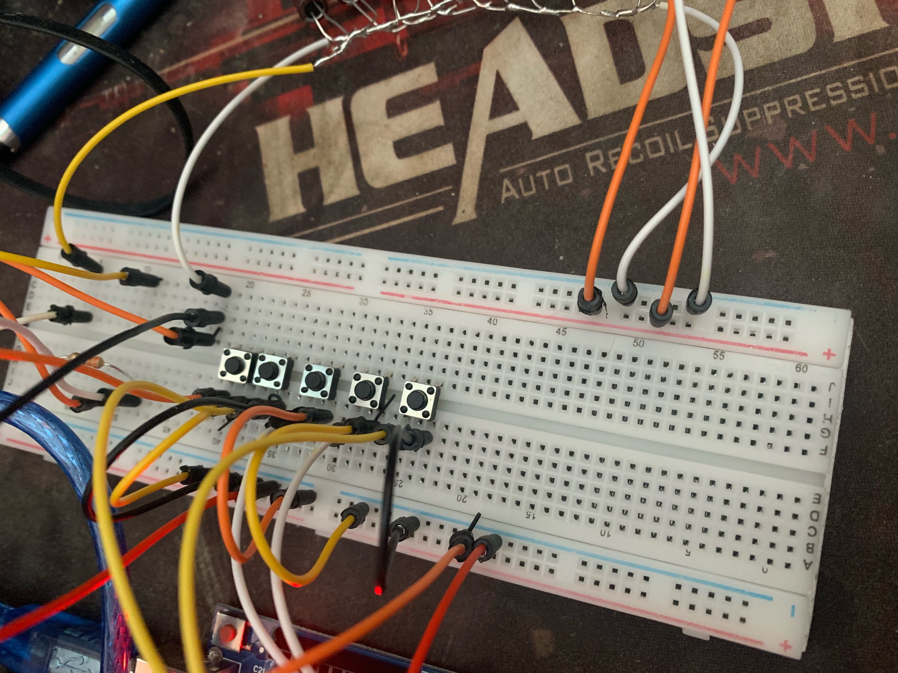
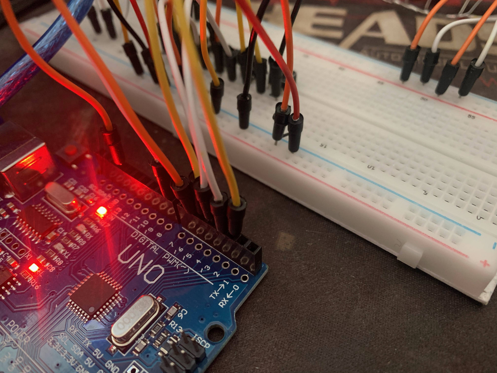
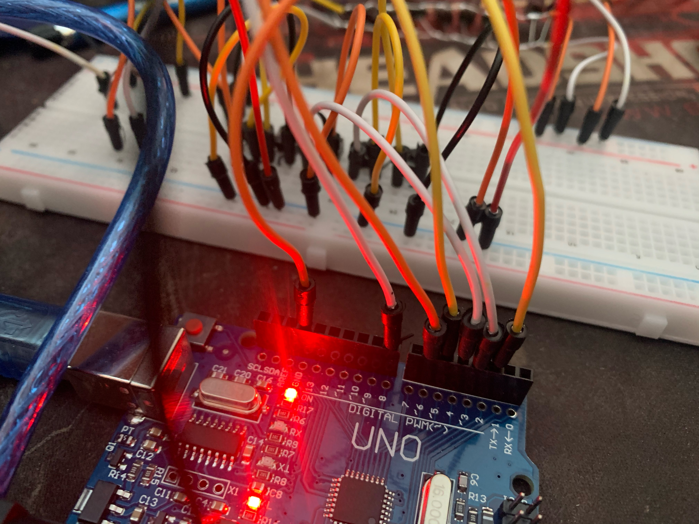
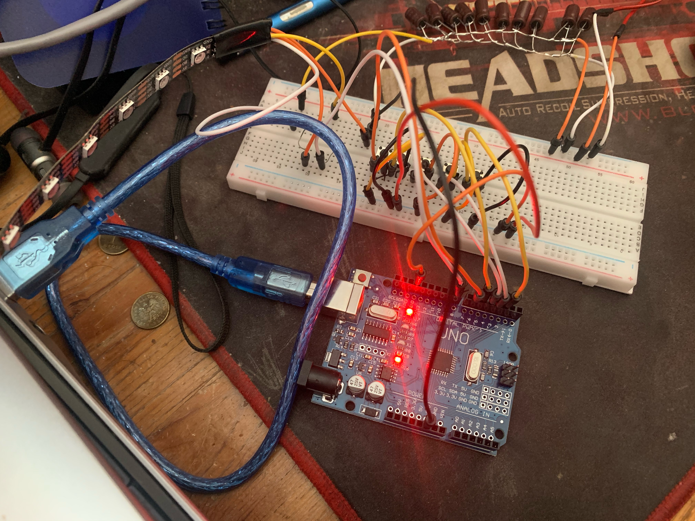

#  Projekt led sterowany na przyciski
## Opis projektu
Układ sterowania paskiem RGB. Projekt będzie polegał na sterowaniu po przez przyciski kolorami paska LED RGB. 

Przy wykorzystaniu: 
- arduino uno, 
- pasek led RGB WS2813B, 
- 5 x przcisków ,
- zasilacz 5V 3A,
- rezystor 330WW,
- 10 x kondenstaro elektrolityczny 100uF.

Układ po przycisnięciu przycisku, będzie wykonywał różne funkcje:
- Przycisk pierwszy będzie powodował zapalanie pokolei ledów na jeden kolor, aż to zapełnienia całego paska jednym kolorem.
- Przycisk drugi będzie powodował mruganie pokolei co określony odstęp ledów w takim samym kolorze, 
- Przycisk trzeci będzie powodował palenie się ledów jak tzw."policyjne bomby",
- Przycisk czwarty będzie powodował tworzenie tęczy płynnie przechodzącej po pasku led,
- Przycisk piąty będzie służył do czyszczenia paska led oraz umożliwienie włączenia innej funkcji.

## Wykonany układ na zdjęciach





## Film pokazujący działanie układu
https://youtu.be/r7FylPGo1qg

## Opis kodu

Kod jest wykonany na pasek o długości 60 ledów. Przy tworzeniu programu wykorzystaliśmy bibliotekę Adafruit_NeoPixel. W tej części kodu przypisujemy wszystkie piny, ilość ledów, stały czas opóźnienia oraz wpisujemy bilioteke z której korzystamy.

``` c++
#include <Adafruit_NeoPixel.h> // biblioteka wykorzystana przy tworzeniu
int buttonPin1 = 2; // pin na którym jest przycisk 1
int buttonPin2 = 3; // pin na którym jest przycisk 2
int buttonPin3 = 4; // pin na którym jest przycisk 3
int buttonPin4 = 5; // pin na którym jest przycisk 4
int buttonPin5 = 6; // pin na którym jest przycisk 5
int delayTime = 20; //opóżnienie
int ledPin = 8; // pin na którym jest podłączona dioda
int ledCount = 60; // ilość diod
Adafruit_NeoPixel strip(ledCount, ledPin, NEO_GRB + NEO_KHZ800);
```

Następnie komunikujemy się z płytką co ma być wykonywane.

``` c++
void setup()                    
{
pinMode(buttonPin1, INPUT_PULLUP); //przypisanie pinu jako wejście
pinMode(buttonPin2, INPUT_PULLUP);
pinMode(buttonPin3, INPUT_PULLUP);
pinMode(buttonPin4, INPUT_PULLUP);
pinMode(buttonPin5, INPUT_PULLUP);
pinMode(ledPin, OUTPUT); //przypisanie pinu jako wyjście
strip.show(); // wyłacza wszystkie ledy i inicjalizuje
}
```

Kolejnie przypisaliśmy jaki przycisk będzie wykonywał poszczególne funkcje programu. W poszczególnych funkcjach mogliśmy ustawić kolory jakie nam się wyświetlały.

``` c++
void loop()  {          

    
if (isButtonPressed(buttonPin1)){ // pierwsza funkcja naprzemiennie zmieniają się kolory 
  for (int i = 0; i < 1000000; i++){
colorchanges(strip.Color(  127,   127, 50), 10); 
colorchanges(strip.Color(  127,   0, 255), 10); // przypisanie koloru
colorchanges(strip.Color(255,   0,   0), 10);
colorchanges(strip.Color(  0, 255,   0), 10); 
colorchanges(strip.Color(  0,   0, 255), 10); 
if (isButtonPressedoff(buttonPin5))//podczas kliknięcia przycisku 5 kończymy pętle i przechodzimmy do funkcji przypisanej na 5 przycisku
break;
  }
} 


  if (isButtonPressed(buttonPin2)){ //druga funkcja mruganie paska poszczególnymi kolorami
     for (int i = 0; i < 1000000; i++){
  blinkingcolor(strip.Color(127, 127, 127), 10); //przypisanie koloru
  blinkingcolor(strip.Color(127,   0,   0), 10); 
  blinkingcolor(strip.Color(  0,   0, 127), 10); 
if (isButtonPressedoff(buttonPin5))//podczas kliknięcia przycisku 5 kończymy pętle i przechodzimmy do funkcji przypisanej na 5 przycisku
break;
  }
  }

 if (isButtonPressed(buttonPin3)){ //trzecia funckja mruganie policyjnych świateł
   for (int i = 0; i < 1000000; i++){
  bomby2(strip.Color(  0,   0, 255), 10); 
  bomby(strip.Color(0,   0,   255), 10); //przypisanie niebieskich światełe
  bomby3(strip.Color(0,   0,   255), 10);
   bomby(strip.Color(0,   0,   255), 10);
 bomby2(strip.Color(  0,   0, 255), 10);
  bomby(strip.Color(0,   0,   255), 10); 
 bomby4(strip.Color(0,   0,   255), 10);
  bomby(strip.Color(0,   0,   255), 10);
  bomby2(strip.Color(  0,   0, 255), 10);
if (isButtonPressedoff(buttonPin5))//podczas kliknięcia przycisku 5 kończymy pętle i przechodzimmy do funkcji przypisanej na 5 przycisku
break;
  }
  }
  
if (isButtonPressed(buttonPin4)){ //czwarta funkcja przechodząca tęcza
   for (int i = 0; i < 1000000; i++){
        rainbow(10); 
if (isButtonPressedoff(buttonPin5))//podczas kliknięcia przycisku 5 kończymy pętle i przechodzimmy do funkcji przypisanej na 5 przycisku
break;
  }
    }


if (isButtonPressed(buttonPin5)){ //wyłączenie pokolei paska led
over(strip.Color( 0 , 0, 0),10); //brak ustawionego koloru co pozwoli po kolei wyłączać diody
}
}
```

W tej części zostało napisane działanie przycisku oraz jak powinien on reagować.

``` c++
bool isButtonPressedoff (int button) { // przypisanie działania przycisków, żeby wyłączyć ledy
  if (digitalRead(button) == LOW) { 
    delay(1);
    if (digitalRead(button) == LOW) {
      return true;
    }
  }
  return false;
}

bool isButtonPressed (int button) { // przypisanie działania przycisków
  if (digitalRead(button) == LOW) { 
    delay(delayTime);
    if (digitalRead(button) == HIGH) {
      return true;
    }
  }
  return false;
}
```

Dotarliśmy do części kodu w którym zostaje przypisana pierwsza funkcja. Jest to zmiana kolorów po kolei. Zostaje usatwiony kolor ledowi i następnie kolejny led dostaje ten sam kolor. Płynnie i pokolei zostanie przypisany ten sam kolor ledom, aż do wypełnienia całego paska led. Następnie możemy powtórzyć funkcje przypisując kolejny kolor i zostanie to wszystko powtórzone.

``` c++
void colorchanges(uint32_t color,int wait) { //funkcja 1
  for(int i=0; i<strip.numPixels(); i++) { // każdemu ledowi pokolej zostaje ustawiony kolor
    strip.setPixelColor(i, color);         // ustawienie koloru piksela
if (isButtonPressedoff(buttonPin5))//podczas kliknięcia przycisku 5 kończymy pętle i przechodzimmy do funkcji przypisanej na 5 przycisku
break;

    strip.show();                          //uaktualnienie paska
    delay(30);                       //opóźnienie
}
}
```

Następna część kodu to mruganie ledów. Zostaje ustalony kolor na jaki ma mrugać pasek. Następnie ustalamy że led pierwszy zaczyna się świeć następniegaśnie i zapala się następny jest następny. Ledy tak wykonują od 1 do 5,a cykl ten się powtarza co 5 led. Animacja jest powtarzana kilkukrotnie, co powodóje wizualizacje mrugania paska. 

``` c++
void blinkingcolor(uint32_t color, int wait) { //funkcja 2
  for(int a=0; a<15; a++) { //powtórzenie animacji do 15 razy
    for(int b=0; b<5; b++) {  // mraganie po kolei kazdego leda
      strip.clear();        //czeszczenie ledów
      for(int c=b; c<strip.numPixels(); c += 5) { // co 5 ledów powtarza się cykl
        strip.setPixelColor(c, color); // ustawienie koloru piksela
      }
if (isButtonPressedoff(buttonPin5))//podczas kliknięcia przycisku 5 kończymy pętle i przechodzimmy do funkcji przypisanej na 5 przycisku
break;
      strip.show();    //uaktualnienie paska
      delay(80); //opóźnienie
    }
  }
}
```
W tej części wykorzystując poprzednie funkcje z których została wykonana próba odwzorowanie działania policyjnych świateł "kogutów". Umożliwia nam to sprawdzenie możliwości tych paru linijek kodu oraz uświadomienie jak wiele rzeczy można wykonać.

``` c++
void bomby(uint32_t color, int wait) { //funkcja 3 identyczny kod jak powyżej tylko zmienione dane 
  for(int a=0; a<15; a++) {
    for(int b=0; b<5; b++) { 
      strip.clear();        
      for(int c=b; c<strip.numPixels(); c += 4) {
        strip.setPixelColor(c, color);
      }
if (isButtonPressedoff(buttonPin5))//podczas kliknięcia przycisku 5 kończymy pętle i przechodzimmy do funkcji przypisanej na 5 przycisku
break;
      strip.show();    //uaktualnienie paska
      delay(30); //opóźnienie
    }
  }
}

void bomby2(uint32_t color,int wait) { // identyczny jak funkcja 1
  for(int i=0; i<strip.numPixels(); i++) {
    strip.setPixelColor(i, color);   
if (isButtonPressedoff(buttonPin5))//podczas kliknięcia przycisku 5 kończymy pętle i przechodzimmy do funkcji przypisanej na 5 przycisku
break;
    strip.show();                          
    delay(10);
  }
}             

void bomby3(uint32_t color, int wait) { //funkcja 3 identyczny kod jak powyżej tylko zmienione dane 
  for(int a=0; a<15; a++) {
    for(int b=0; b<60; b++) { 
      strip.clear();        
      for(int c=b; c<strip.numPixels(); c +=1) {
        strip.setPixelColor(c, color);
      }
if (isButtonPressedoff(buttonPin5))//podczas kliknięcia przycisku 5 kończymy pętle i przechodzimmy do funkcji przypisanej na 5 przycisku
break;
      strip.show();    //uaktualnienie paska
      delay(5); //opóźnienie
    }
  }
}

void bomby4(uint32_t color, int wait) { //funkcja 3 identyczny kod jak powyżej tylko zmienione dane 
  for(int a=0; a<15; a++) {
    for(int b=0; b<60; b++) { 
      strip.clear();        
      for(int c=b; c<strip.numPixels(); c +=60) {

        strip.setPixelColor(c, color);
      }
if (isButtonPressedoff(buttonPin5))//podczas kliknięcia przycisku 5 kończymy pętle i przechodzimmy do funkcji przypisanej na 5 przycisku
break;
      strip.show();    //uaktualnienie paska
      delay(3); //opóźnienie
    }
  }
}
```

W tej części wykonaliśmy płynnie zmieniającą się tęcze na pasku. Żeby stworzyć daną funkcje wykorzystaliśmy pełną paletę kolorów. Tą część starałem się wyjaśnić na kodzie, który jest poniżej tak by było jak najbardziej prosto.

``` c++
void rainbow(int wait) { //funkcja 4
  for(long firstledhue = 0; firstledhue < 10* 65536; firstledhue += 256) { //wykorzystujemy koło kolorów i opisujemy ilość wykoanych pętli powtórzeń
    for(int i=0; i<strip.numPixels(); i++) { // wykonujemy dla każdego leda
      int ledhue = firstledhue + (i * 65536L / strip.numPixels()); // wykonanie przesunięcia odcienia leda tak by wykonało pełen obórót kolorów
      strip.setPixelColor(i, strip.gamma32(strip.ColorHSV(ledhue)));// ustawienie pełnego zakresu kolorów
    }
if (isButtonPressedoff(buttonPin5)) //podczas kliknięcia przycisku 5 kończymy pętle i przechodzimmy do funkcji przypisanej na 5 przycisku
break;
    strip.show();     //uaktualnienie paska
    delay(30);  //opóźnienie
  
  }
}
```
Tutaj wykorzystaliśmy pierwszą funkcje zmieniająć tylko jedną rzecz tak by móc gasić pasek pokolei od początku z ledów które się świecą.

``` c++
void over(uint32_t color,int wait) { //identyczna  funkcja jak 1 z brakiem wyjścia
  for(int i=0; i<strip.numPixels(); i++) { 
    strip.setPixelColor(i, color);        
    strip.show();                        
    delay(30);                       
}
}
```
## Miłej zabawy dalej kodem!
